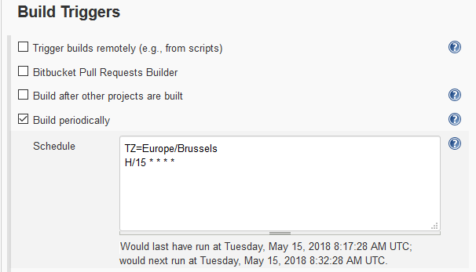

# jam
Jenkins Agent Manager


[](https://travis-ci.org/Mulugruntz/jam)
[](https://codeclimate.com/github/Mulugruntz/jam/maintainability)
[](https://codeclimate.com/github/Mulugruntz/jam/test_coverage)
[](https://codeclimate.com/github/Mulugruntz/jam/issues)
[](https://pyup.io/repos/github/Mulugruntz/jam/)
[](https://pyup.io/repos/github/Mulugruntz/jam/)
[](https://github.com/Mulugruntz/jam/blob/master/LICENSE)


## Goal of this tool

Optimizing cost of Jenkins' Google Compute Engine -based agent nodes. Whenever an agent is needed, an offline node gets booted up. And whenever it's idle, it's switched back off.

## How to set it up

In Jenkins, create a new `Freestyle project` (go to `http://<JENKINS_URL>/view/all/newJob`). Name it `Jam` (or whichever name you like).

#### Restrict it on `master` node

This job should only run on master (it should actually be the only job that ever runs on your `master` node).


#### Make it periodic

In case this tool crashes, it'd better restart automatically, asap. 
I've had it on for weeks but it has happened that it crashed in the 
past (due to an upgrade from pip 9 to pip 10 for instance).

I suggest you put a 15 minutes cron on it. So, Jenkins will automatically queue a new Jam every 15 minutes
if there is none queued yet. If there is one already, nothing will happen. This way, if your job comes to die,
the next in the queue will immediately start up.



#### Start with a clean workspace

I advise you to check `Delete workspace before build starts`.


#### Execute Jam

Under `Build`, click on `Add build step` and select `Execute shell`. Then, put the following code:

```bash
/usr/bin/env python -m pip install --user --upgrade pip
/usr/bin/env python -m pip install --user virtualenv
python -m virtualenv env
. env/bin/activate

git clone https://github.com/Mulugruntz/jam.git
cd jam
pip install -r requirements.txt

export PYTHONPATH=$WORKSPACE:$PYTHONPATH

python jam/startup.py \
  --project=<jam-project> \
  --gce-zone=<gce-zone> \
  --jenkins-url=<http://my_jenkins.url> \
  --jenkins-api-token=<0123456789abcdef0123456789abcdef> \
  --jenkins-username=<user> \
  build4 build8 build15 build16 build23 build42
```

Don't forget to replace every `<string>` above.

## Usage

```text
usage: startup.py [-h] -p PROJECT [-z GCE_ZONE] -l JENKINS_URL
                  [-u JENKINS_USERNAME] [-t JENKINS_API_TOKEN]
                  NODE_LIST [NODE_LIST ...]

Jenkins Agent Manager -- Manages agents on Google Compute Engine.

positional arguments:
  NODE_LIST             Names of the nodes to use

optional arguments:
  -h, --help            show this help message and exit

Google Compute Engine:
  GCE-related arguments

  -p PROJECT, --project PROJECT
                        Name of the Google Compute Engine project
  -z GCE_ZONE, --gce-zone GCE_ZONE
                        Google Compute Engine zone (see
                        https://cloud.google.com/compute/docs/regions-zones/ )

Jenkins:
  Jenkins-related arguments

  -l JENKINS_URL, --jenkins-url JENKINS_URL
                        URL to the Jenkins Server
  -u JENKINS_USERNAME, --jenkins-username JENKINS_USERNAME
                        The Jenkins user
  -t JENKINS_API_TOKEN, --jenkins-api-token JENKINS_API_TOKEN
                        The Jenkins API Token
```

## Contributing

If you do want to contribute, please add this pre-commit hook:
```bash
ln -s -f pre-commit.sh .git/hooks/pre-commit
```

It is made to update this `README.md` file using the usage output.

You can also update it manually (just bother if you actually changed the CLI arguments).
